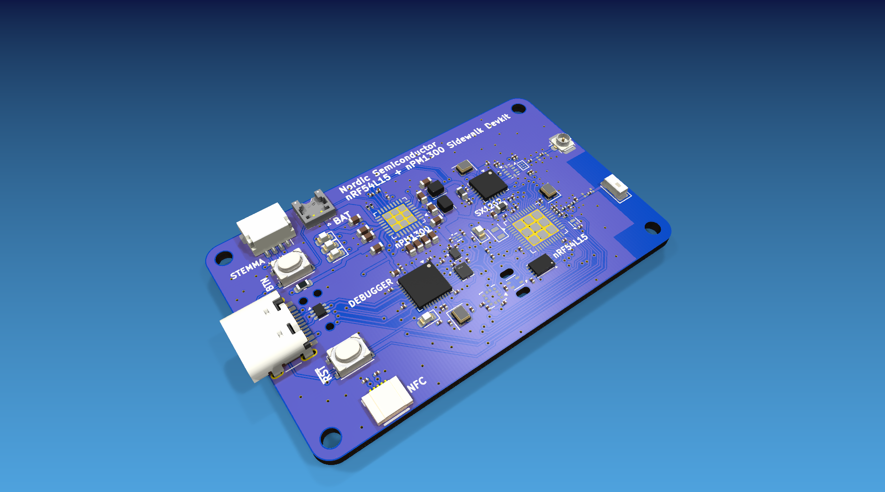
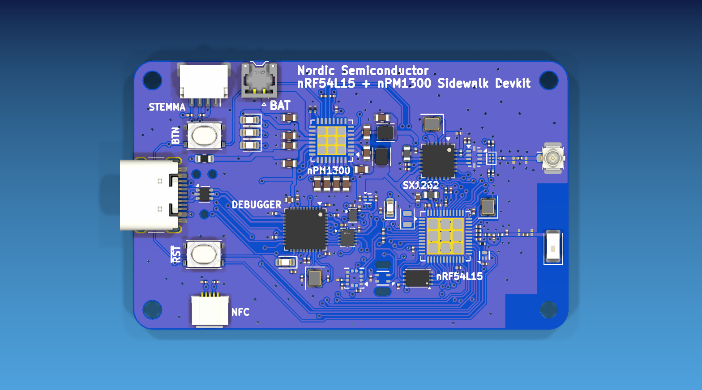
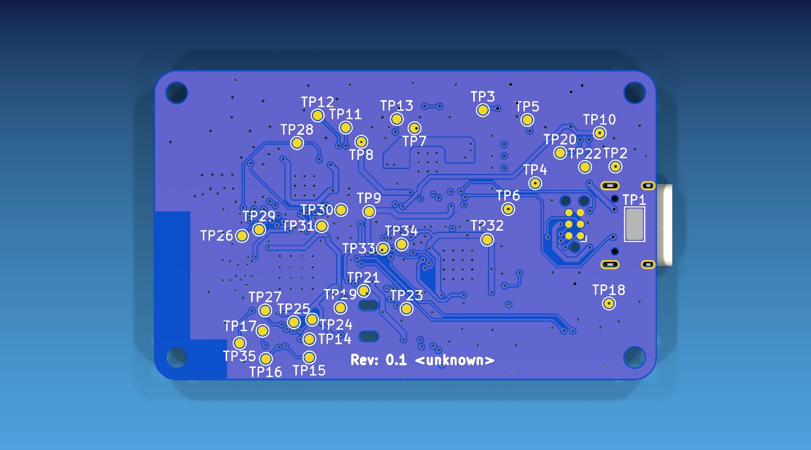

# Sidewalk Devkit

KiCad hardware design for a compact Nordic Semiconductor devkit built around an
`nRF54L15` target, `nPM1300` power management, and an `SX1262` sub-GHz radio
front end.



## Hardware

- `nRF54L15-QFAA` target SoC with external `32 MHz` and `32.768 kHz` crystals.
- `nPM1300-QEAA` PMIC for USB/battery power management, charging, and status LEDs.
- `SX1262IMLTRT` sub-GHz transceiver with RF switch/filter network, U.FL, and chip antenna footprints.
- On-board `nRF52833-QDXX` debug helper with USB, SWD, UART, and level-translated target boundary.
- USB-C input with ESD protection and a 1 A fuse.
- Battery connector, reset/user buttons, and board-edge debug/test access.
- `STEMMA QT` I2C expansion connector.
- `SHT4x` humidity/temperature sensor, `ADXL367` accelerometer, and `ZD25WQ16CEIGR` QSPI flash.
- NFC connector footprint and user/status LEDs.

## Board

| Property | Value |
| --- | --- |
| KiCad version | 10.x project files |
| Board revision | `0.1` |
| Size | `55 mm x 34 mm` |
| Stackup | 6 copper layers, 1.6 mm board thickness |
| Minimum track / clearance | `0.127 mm / 0.127 mm` |
| Minimum drill | `0.200 mm` |

### Top



### Bottom



## Schematic Structure

The design is split into hierarchical KiCad sheets:

- `sch/nRF54L15.kicad_sch` - target SoC, sensors, QSPI flash, STEMMA QT, NFC, and user IO.
- `sch/SX1262.kicad_sch` - sub-GHz radio, RF matching/filtering, antenna switch, and RF connectors.
- `sch/nPM1300.kicad_sch` - USB-C, battery input, PMIC rails, charger support, and PMIC LEDs.
- `sch/Debugger.kicad_sch` - on-board debug helper, target SWD/UART boundary, and level shifting.

## Repository Layout

```text
.
|-- Sidewalk_Devkit.kicad_pro   KiCad project
|-- Sidewalk_Devkit.kicad_sch   Top-level schematic
|-- Sidewalk_Devkit.kicad_pcb   PCB layout
|-- sch/                        Hierarchical schematic sheets
|-- lib/                        Local symbols, footprints, and 3D models
|-- docs/images/                README render images
|-- build/                      Local generated outputs, ignored by git
`-- debug_helper_parts.md       Notes for the debug-helper boundary parts
```

## Regenerating Outputs

The README images are rendered directly from the KiCad PCB:

```bash
mkdir -p docs/images

kicad-cli pcb render Sidewalk_Devkit.kicad_pcb \
  --output docs/images/sidewalk-devkit-hero.png \
  --width 1800 --height 1000 \
  --background opaque --quality high --perspective \
  --rotate '-35,0,35' --zoom 0.84

kicad-cli pcb render Sidewalk_Devkit.kicad_pcb \
  --output docs/images/sidewalk-devkit-top.png \
  --width 1600 --height 900 \
  --side top --background opaque --quality high --zoom 1.12

kicad-cli pcb render Sidewalk_Devkit.kicad_pcb \
  --output docs/images/sidewalk-devkit-bottom.png \
  --width 1600 --height 900 \
  --side bottom --background opaque --quality high --zoom 1.12
```

Useful local exports:

```bash
mkdir -p build

kicad-cli sch export pdf Sidewalk_Devkit.kicad_sch \
  --output build/schematic.pdf

kicad-cli pcb export step Sidewalk_Devkit.kicad_pcb \
  --output build/board.step

kicad-cli sch export bom Sidewalk_Devkit.kicad_sch \
  --output build/bom.csv \
  --fields Reference,Value,Footprint,QUANTITY,DNP \
  --group-by Value,Footprint
```

The custom EasyEDA-derived footprints and 3D models live under `lib/`. STEP
export may still warn if a local KiCad installation does not include every
referenced stock KiCad 3D model.

Run design checks before fabrication or release:

```bash
mkdir -p build
kicad-cli sch erc Sidewalk_Devkit.kicad_sch --output build/erc.rpt
kicad-cli pcb drc Sidewalk_Devkit.kicad_pcb --output build/drc.rpt
```

## License

This hardware design is licensed under the CERN Open Hardware Licence Version 2
- Permissive. See [LICENSE](LICENSE).
